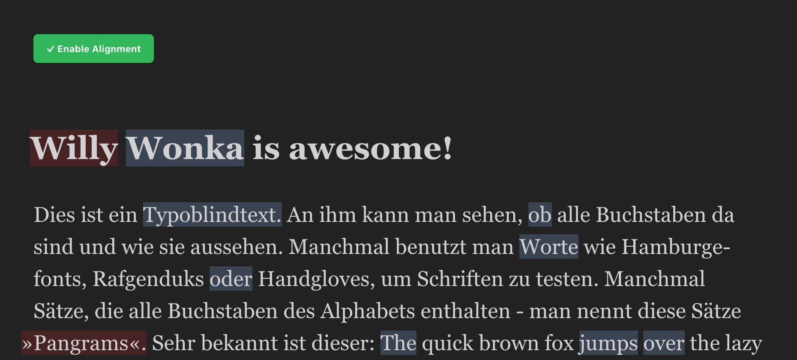

# Optical Aligned Text Example



Hey folks! This is the example project for the optical-aligned-text react component.

You can also edit this example on codesandbox:  
<br/>
[](https://codesandbox.io/s/cocky-http-noexe?fontsize=14&hidenavigation=1&theme=dark)

## Install

```shell
yarn
# or
npm i
```

### Run the project

```
yarn start
# or
npm run start
```
